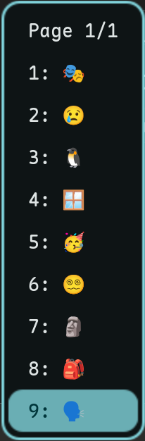

# Fcitx5 Niri DMS Theme

A dynamic Fcitx5 theme that automatically synchronizes with **Dank Material Shell (DMS)** and **Matugen** colors/layout.
Inherits the sleek border style from [Ori-fcitx5](https://github.com/Reverier-Xu/Ori-fcitx5) but adds dynamic capabilities.



## Features

- **Color Sync:** Automatically pulls Background, Foreground, and Primary (Accent) colors from Matugen (`qt6ct/matugen.conf`).
- **Layout Sync:** Matches the `geometry-corner-radius` defined in your DMS layout.
- **Consistent Corner Radius:** Highlight corner radius is automatically adjusted relative to panel radius so both visually align.
- **Tunable Highlight Padding:** Control the vertical and horizontal padding of the selected candidate box via constants in the script.
- **Tunable Border Thickness:** Override panel border width independently from DMS layout.
- **HiDPI Support:** `ScaleWithDPI` is enabled automatically.
- **Easy Installation:** Interactive script to generate and install the theme locally.

## Requirements

- Fcitx5
- Dank Material Shell (for color/layout sources)
- Python 3

## Usage

### 🚀 Quick Install

```bash
git clone https://github.com/hthienloc/fcitx5-niri-dms.git && cd fcitx5-niri-dms && ./install.sh
```

### Manual Installation

1. Clone the repository:
   ```bash
   git clone https://github.com/hthienloc/fcitx5-niri-dms.git
   cd fcitx5-niri-dms
   ```

2. Run the generator script:
   ```bash
   python3 generate_theme.py
   ```

3. Follow the prompts to install the theme to `~/.local/share/fcitx5/themes/niri-dms` and optionally restart Fcitx5.

4. Open **Fcitx5 Configuration** and navigate to:
   `Addons` → `Classic User Interface` (click Configure) → `Theme` (or `Dark Theme`) → select **DMS Niri**.

## Customization

Open `generate_theme.py` and edit the constants at the top of the file:

```python
# Highlight box padding (px)
HIGHLIGHT_V_PADDING = 2   # top/bottom
HIGHLIGHT_H_PADDING = 1   # left/right

# Panel border thickness (px). Set to None to use value from layout.kdl
PANEL_BORDER_WIDTH_OVERRIDE = 4
```

Re-run `python3 generate_theme.py` after any change to apply.

## Credits

- Base SVG assets and layout ideas from [Ori-fcitx5](https://github.com/Reverier-Xu/Ori-fcitx5).
- Designed for use with [Dank Material Shell](https://github.com/AvengeMedia/DankMaterialShell).